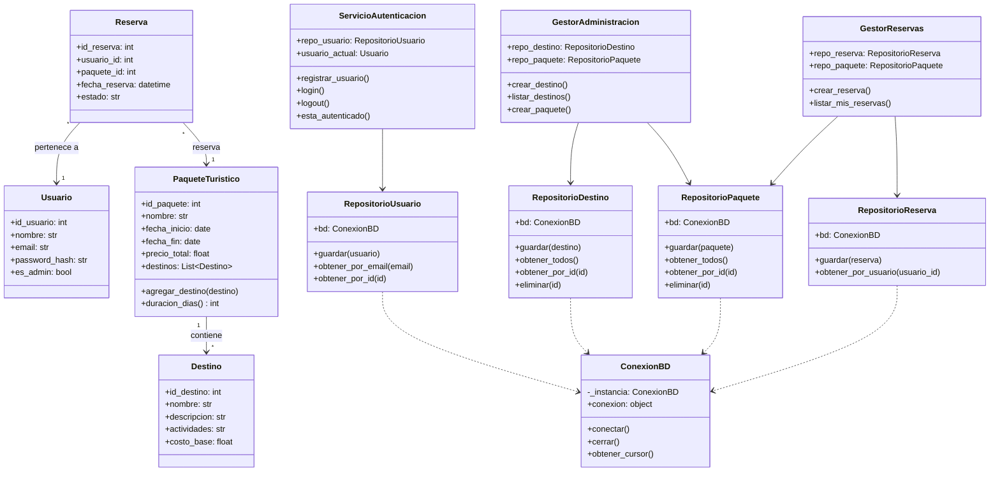

# Diseño del Sistema - Viajes Aventura

Este documento contiene el diagrama de clases UML que representa la arquitectura del sistema, incluyendo modelos, repositorios y servicios.

## Diagrama de Clases

