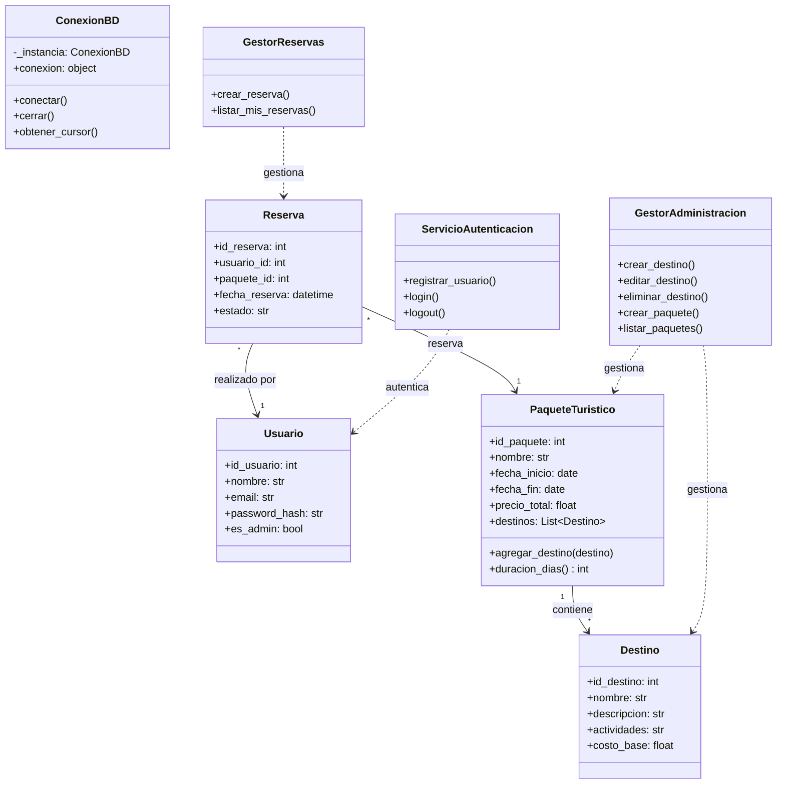

# Documentación del Sistema - Viajes Aventura

Este documento proporciona una visión técnica y operativa del sistema "Viajes Aventura", incluyendo su estructura a través de diagramas UML y la descripción de sus procesos de negocio principales.

## 1. Diagramas UML

### 1.1 Diagrama de Clases
Representa la jerarquía de objetos, sus atributos, métodos y las relaciones entre los componentes de persistencia (repositorios), lógica (servicios) y datos (modelos).



### 1.2 Diagrama de Casos de Uso
Describe las interacciones entre los usuarios (actores) y las funcionalidades del sistema.

```mermaid
useCaseDiagram
    actor "Cliente" as C
    actor "Administrador" as A

    package "Viajes Aventura System" {
        usecase "Registrarse / Login" as UC1
        usecase "Ver Paquetes Disponibles" as UC2
        usecase "Reservar Paquete" as UC3
        usecase "Ver mis Reservas" as UC4
        
        usecase "Gestionar Destinos (CRUD)" as UC5
        usecase "Crear Paquetes Turísticos" as UC6
        usecase "Actualizar Precios/Disponibilidad" as UC7
    }

    C --> UC1
    C --> UC2
    C --> UC3
    C --> UC4

    A --> UC1
    A --> UC5
    A --> UC6
    A --> UC7
    
    UC6 ..> UC5 : <<include>>
```

---

## 2. Procesos de Negocio Detallados

### 2.1 Gestión de Reservas
Describe el flujo desde que un cliente decide viajar hasta la confirmación de la reserva.

1.  **Autenticación**: El usuario debe iniciar sesión. El sistema verifica las credenciales a través de `ServicioAutenticacion`.
2.  **Selección**: El usuario consulta la lista de paquetes disponibles (`GestorAdministracion.listar_paquetes`).
3.  **Solicitud de Reserva**: El usuario invoca `GestorReservas.crear_reserva(usuario, paquete_id)`.
4.  **Validación de Existencia**: El sistema verifica que el paquete exista en `RepositorioPaquete`.
5.  **Persistencia**: Se crea un objeto `Reserva` y se almacena en `RepositorioReserva`. 
6.  **Confirmación**: El sistema retorna el objeto reserva creado, confirmando el proceso.

### 2.2 Actualización de Destinos
Proceso administrativo para mantener la oferta turística al día.

1.  **Inicio**: El administrador accede al módulo de gestión.
2.  **Edición**: Se invoca `GestorAdministracion.editar_destino(id, datos...)`.
3.  **Instanciación**: Se crea o actualiza el objeto `Destino`.
4.  **Actualización en BD**: `RepositorioDestino.guardar(destino)` ejecuta un `UPDATE` en la tabla `destinos`.
5.  **Efecto Cascada**: Los paquetes que incluyen este destino reflejarán los cambios (nombre, descripción, costo base) en futuras consultas, ya que se obtienen mediante `JOIN` en tiempo real.

### 2.3 Disponibilidad y Precios de Paquetes
Cómo el sistema calcula y filtra la oferta disponible.

1.  **Cálculo de Precio**: Al crear o actualizar un paquete en `RepositorioPaquete.guardar`, el sistema calcula automáticamente el `precio_total` sumando:
    *   Suma de `costo_base` de todos los destinos asociados.
    *   Un costo operativo diario (ej: $50.0) multiplicado por la duración en días (`fecha_fin - fecha_inicio`).
2.  **Filtrado por Disponibilidad**: El sistema gestiona la disponibilidad mediante fechas. Al buscar paquetes, `GestorAdministracion.buscar_paquetes(fecha_inicio, fecha_fin)` filtra aquellos cuya ventana de operación esté dentro del rango solicitado.
3.  **Actualización de Disponibilidad**: La disponibilidad se actualiza simplemente modificando las fechas del paquete o eliminando/ocultando el paquete si no hay cupos (lógica extensible en `RepositorioPaquete`).
